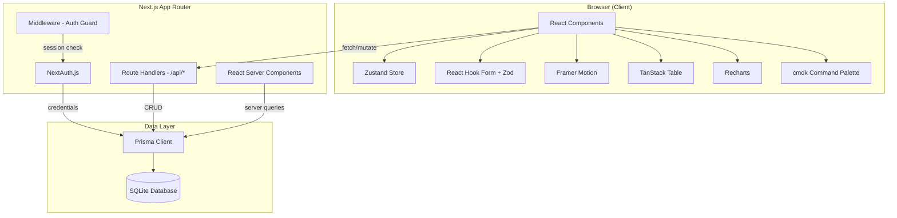

# Embark OS - Architecture

## System Architecture



## Request Lifecycle

### Server Component (Read)
1. Browser requests route (e.g., `/locations/hound-around`)
2. Middleware checks NextAuth session - redirects to `/login` if missing
3. Server Component fetches data via Prisma Client directly
4. RSC renders HTML with data, streams to client
5. Client hydrates with Zustand state + Framer Motion animations

### API Route (Write)
1. Client fires mutation (e.g., PATCH location status)
2. Zustand applies optimistic update immediately
3. Route Handler (`/api/locations/[id]`) receives request
4. Validates session server-side via `getServerSession()`
5. Validates body with Zod schema
6. Prisma executes write, returns updated record
7. Client reconciles server response (or reverts on error)
8. Toast notification confirms save

## Auth Flow

```
/login (public)
  |
  v
NextAuth credentials provider
  |
  v
Check env: ADMIN_EMAIL + ADMIN_PASSWORD
  |
  v
JWT session (httpOnly cookie)
  |
  v
middleware.ts: protect all routes except /login, /api/auth/*
```

Single-user auth. No registration. Password stored as env var.

## Component Hierarchy

```
RootLayout
  |
  +-- (auth)/login/page.tsx       # Public login form
  |
  +-- (dashboard)/layout.tsx      # Protected shell
        |
        +-- Sidebar               # Collapsible nav (Zustand state)
        +-- Topbar                # Page title, breadcrumbs, user menu
        +-- CommandPalette        # Cmd+K (cmdk)
        +-- <children>            # Route content
              |
              +-- page.tsx        # Portfolio overview (cards grid)
              +-- locations/
              |     +-- page.tsx  # TanStack Table view
              |     +-- [slug]/page.tsx  # Detail with 7 tabs
              +-- pipeline/page.tsx    # Kanban boards
              +-- metrics/page.tsx     # Lighthouse scores + charts
              +-- contacts/page.tsx    # Contact directory table
              +-- settings/page.tsx    # Preferences
```

## State Management

| Layer | Tool | Scope |
|-------|------|-------|
| Server state | Prisma (RSC) | Database reads in Server Components |
| Client mutations | fetch + Route Handlers | CRUD via `/api/*` routes |
| UI state | Zustand | Sidebar collapsed, active tab, view prefs |
| Form state | React Hook Form | Inline editing, note creation, settings |
| Optimistic updates | Zustand + fetch | Status changes, inline edits |

No global data cache (like React Query/SWR). Server Components handle reads. Mutations use fetch + `router.refresh()` to revalidate.
