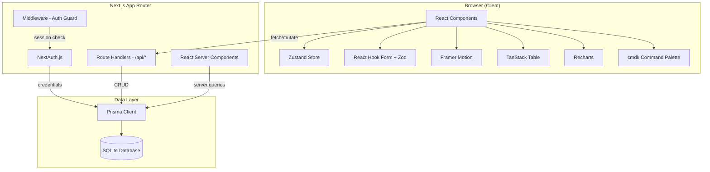

# Embark OS - Architecture

## System Architecture



## Request Lifecycle

### Server Component (Read)
1. Browser requests route (e.g., `/locations/hound-around`)
2. Middleware checks NextAuth session - redirects to `/login` if missing
3. Server Component fetches data via Prisma Client directly
4. RSC renders HTML with data, streams to client
5. Client hydrates with Zustand state + Framer Motion animations

### API Route (Write — Inline Editing)
1. User clicks a field to enter edit mode (pencil icon appears on hover)
2. User modifies value and saves (blur, Enter, or checkmark button)
3. `useLocationUpdate` hook fires `PATCH /api/locations/[id]`
4. Route Handler validates session server-side via `auth()`
5. Prisma executes write, returns updated record
6. `router.refresh()` revalidates the Server Component with fresh data
7. Toast notification confirms save (Sonner)
8. On error: toast shows failure message, field retains previous value

## Auth Flow

```
/login (public)
  |
  v
NextAuth credentials provider
  |
  v
Check env: ADMIN_EMAIL + ADMIN_PASSWORD
  |
  v
JWT session (httpOnly cookie)
  |
  v
middleware.ts: protect all routes except /login, /api/auth/*
```

Single-user auth. No registration. Password stored as env var.

## Component Hierarchy

```
RootLayout
  |
  +-- (auth)/login/page.tsx       # Public login form
  |
  +-- (dashboard)/layout.tsx      # Protected shell
        |
        +-- Sidebar               # Collapsible nav (Zustand state)
        +-- Topbar                # Page title, breadcrumbs, user menu
        +-- CommandPalette        # Cmd+K (cmdk)
        +-- <children>            # Route content
              |
              +-- page.tsx        # Portfolio overview (cards grid)
              +-- locations/
              |     +-- page.tsx  # TanStack Table view
              |     +-- [slug]/page.tsx  # Detail with 7 tabs
              +-- pipeline/page.tsx    # Kanban boards
              +-- metrics/page.tsx     # Lighthouse scores + charts
              +-- contacts/page.tsx    # Contact directory table
              +-- settings/page.tsx    # Preferences
```

## State Management

| Layer | Tool | Scope |
|-------|------|-------|
| Server state | Prisma (RSC) | Database reads in Server Components |
| Client mutations | `useLocationUpdate` hook + Route Handlers | CRUD via `/api/*` routes |
| UI state | Zustand | Sidebar collapsed, active tab, view prefs |
| Inline editing state | Component-local `useState` | Edit mode, draft values, saving flag |
| Form state | React Hook Form | Note creation, settings |

No global data cache (like React Query/SWR). Server Components handle reads. Mutations use `fetch` + `router.refresh()` to revalidate.

## Inline Editing Architecture

```
User clicks field → InlineEditField/InlineSelectField/InlineToggleField
  |
  v
Component enters edit mode (local state)
  |
  v
User saves (blur / Enter / checkmark)
  |
  v
onSave callback → useLocationUpdate.updateField(field, value)
  |
  v
PATCH /api/locations/[id] → Prisma update → response
  |
  v
Toast (success/error) + router.refresh() → RSC re-renders with fresh data
```

### Inline Edit Components
- `InlineEditField` — Text/textarea with pencil icon, Enter/Escape/blur handling
- `InlineSelectField` — Dropdown for enum fields (platforms, facility types, etc.)
- `InlineToggleField` — Toggle switch for boolean fields (services, requirements, assets)
- `StatusPill` (editable mode) — Clickable pill with dropdown for status changes (migration, rebuild, DNS)
